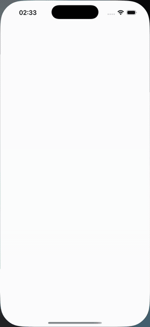
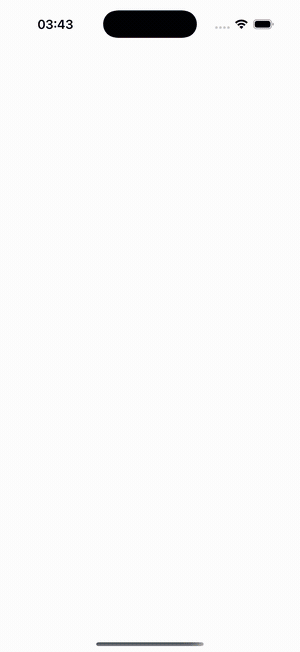

# drag-drop

A flexible iOS drag and drop implementation written in Swift. Drag views
between arbitrary containers, in and out of table views and collection views,
and between two of them — with the destination free to refuse.

Requires iOS 26 and Swift 6.

| Between two collection views | Reordering in place | Between plain views |
| --- | --- | --- |
|  |  |  |

## Installation

Add the package in Xcode, or declare it as a dependency:

```swift
.package(url: "https://github.com/joeypatino/drag-drop.git", branch: "master")
```

Once a release is tagged, prefer the version form:

```swift
.package(url: "https://github.com/joeypatino/drag-drop.git", from: "1.0.0")
```

Then `import DragDrop`.

## The shape of it

One `DragDropController` per drop target. Register the views that should move,
and answer one datasource method saying where a dropped view lands.

```swift
let controller = DragDropController()
controller.dragDropDataSource = self
controller.dropTargetView = containerView

controller.enableDragAction(for: draggableView)
```

```swift
func dragDropController(_ controller: DragDropController,
                        frameFor view: UIView,
                        in destination: DragDropController) -> CGRect {
    // where the view should end up, in the destination's coordinates
}
```

Controllers find each other, so a view dragged out of one target and released
over another is handed across with no wiring between them.

Lists are an extension rather than a separate API — `enableDragAndDrop(for:)` on
the cell, plus a datasource protocol for the model updates.

## Documentation

| | |
| --- | --- |
| [Dragging views](docs/dragging-views.md) | The core API: controllers, the datasource and delegate, closing the gap a dragged view leaves, and the scroll view pickup delay |
| [Collection views](docs/collection-views.md) | Reordering, moving cells between two collection views, and the drop highlight |
| [Table views](docs/table-views.md) | Rows dragging out and dropping in, the row-move datasource, and what it does not support |
| [The demo screens](docs/demos.md) | All seven, with what each one receives and what it proves |
| [Writing UI tests](Demo/DragDropDemoUITests/WRITING-UI-TESTS.md) | Which delay to use and why that number, what makes a query expensive, and what a UI test cannot see |
| [Testing](docs/testing.md) | Schemes, and the one that silently skips a bundle |

## Demo

`Demo/DragDropDemo.xcodeproj` builds an app with seven screens. Each exercises a
distinct capability and is dressed as the kind of app you would actually build
with it, so you can go from "I want to build that" to the file that does it.

| Screen | Capability | Source |
| --- | --- | --- |
| Shift Rota | Four peer drop targets, and a datasource that refuses a drop | `FourByFourViewController` |
| Shared Album | A drop target nested inside another drop target | `EmbeddedViewController` |
| Widget Composer | A drop target inset inside a container that is not one | `DoubleEmbeddedViewController` |
| Files | An individual item that is itself a drop target | `EmbeddedDropTargetViewController` |
| Up Next | Table rows dragging out with gap closing, and dropping in | `NormalTableViewController` |
| Moodboard | Reordering a masonry collection view | `NormalCollectionViewController` |
| Lineup | Moving between two collection views, with a move the datasource can veto | `DoubleCollectionViewController` |

```
open Demo/DragDropDemo.xcodeproj
```

Launch with `-demo <ViewControllerName>` to open straight onto one screen, which
is how the UI tests and screenshots skip the index.
[docs/demos.md](docs/demos.md) walks each screen with a still and a clip of a
real drag, and says which views receive a drop — the thing that separates
otherwise similar-looking screens.

`Sources/DemoKit` supports that app and is not part of the library's public
surface: it holds the demo's colour theme, its slot, masonry and folder
geometry, and its sample content. It lives in the package rather than the app
target so that geometry gets fast unit tests. The demo app therefore links two
package products, `DragDrop` and `DemoKit`.

## Tests

```
xcodebuild test -scheme DragDrop-Package -destination 'platform=iOS Simulator,name=iPhone 17'
xcodebuild test -scheme DragDrop-Package -destination 'platform=iOS Simulator,name=iPhone 17' \
  -only-testing:DemoKitTests
xcodebuild test -project Demo/DragDropDemo.xcodeproj -scheme DragDropDemo \
  -destination 'platform=iOS Simulator,name=iPhone 17'
```

The second line is not redundant — see [docs/testing.md](docs/testing.md).

## License

MIT. See [LICENSE](LICENSE).
