# The demo screens

Seven screens, each built around one arrangement of drop targets. Several look
alike; what separates them is which views receive a drop.

Launch one directly:

```
xcrun simctl launch <device> com.onitaps.Drag-Drop -demo <SegueIdentifier>
```

---

## Shift Rota

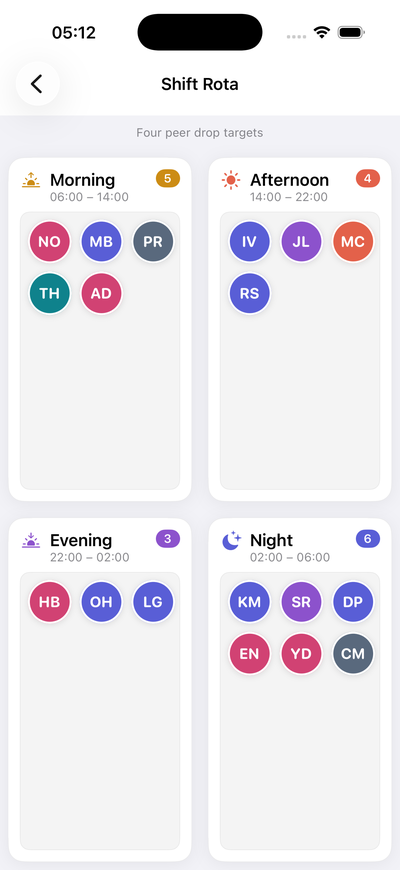 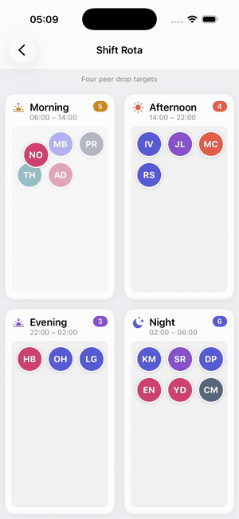

Four panels in a 2x2 grid, each its own drop target, holding staff chips that
can be dragged between them. The datasource refuses a drop onto the shift a
person is already on.

`SeparateTargetsViewController`

---

## Shared Album

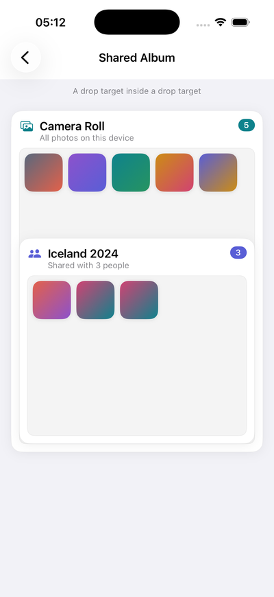 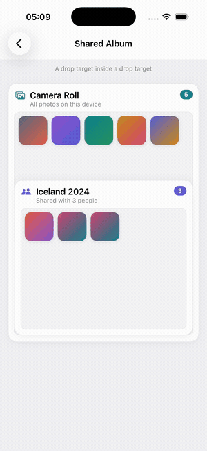

A Camera Roll panel containing an Iceland 2024 panel, both of which receive
photos. A point inside the album lies within two drop targets; the innermost one
takes the drop.

`TargetInsideTargetViewController`

---

## Widget Composer

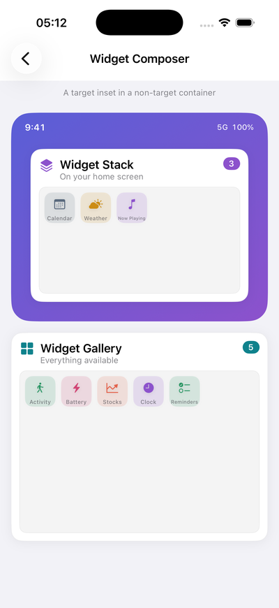 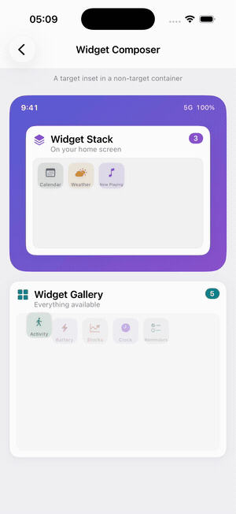

A decorative phone frame holding a Widget Stack panel, with a Widget Gallery
panel below it. The frame is not a drop target; the drag position is translated
through it to reach the stack inside.

`TargetInsideNonTargetViewController`

---

## Files

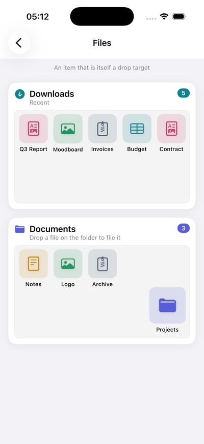 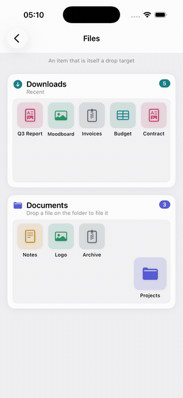

A Downloads panel above a Documents panel, with a Projects folder tile in the
corner of Documents. The folder is an item and a drop target at once; files
dropped on it shrink to pips on its face.

`TargetOnAnItemViewController`

---

## Up Next

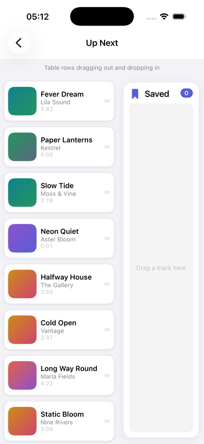 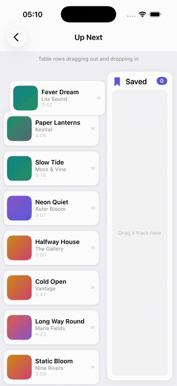

A table of tracks beside a Saved panel. The table as a whole is the drop target,
so a card released anywhere on it lands in the row under the finger. Dragging a
row out removes it and closes the gap.

`TableRowMoveViewController`

---

## Moodboard

 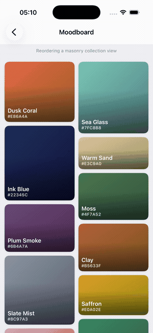

One collection view of 300 cards in a masonry layout. Card heights belong to
positions rather than to cards, so a card resizes into the slot it is dragged
over and the mosaic itself does not move.

`CollectionRearrangeViewController`

---

## Lineup

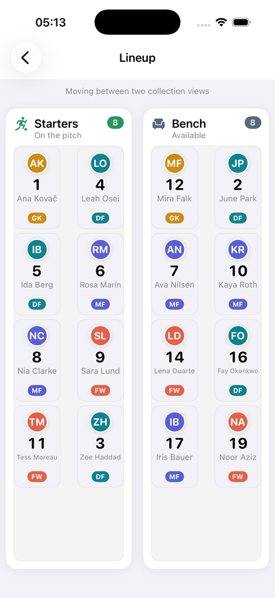 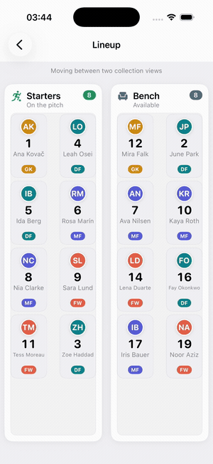

Two collection views side by side, Starters and Bench, each inside a panel that
provides its title and count. The destination refuses a player already on its
list.

`CollectionSwapViewController`

---

## At a glance

| Screen | Receives | Inert | Capability |
| --- | --- | --- | --- |
| Shift Rota | 4 peer panels | | A drop can be refused |
| Shared Album | roll and album inside it | | Nested targets; innermost wins |
| Widget Composer | stack, gallery | the phone frame | Reaching a target through a non-participating ancestor |
| Files | 2 panels and a folder item | | An item that is itself a target |
| Up Next | the table, a panel | | Table rows out and in, with a gap under the finger |
| Moodboard | one collection view | | Reordering in place |
| Lineup | two collection views | the panels around them | Transfer between two collection views, refusable |
